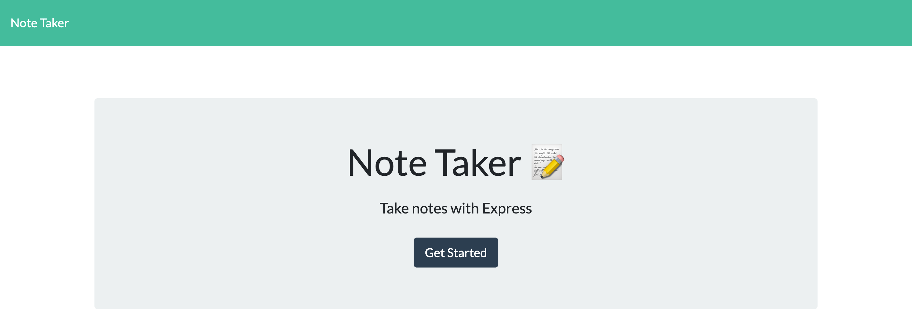
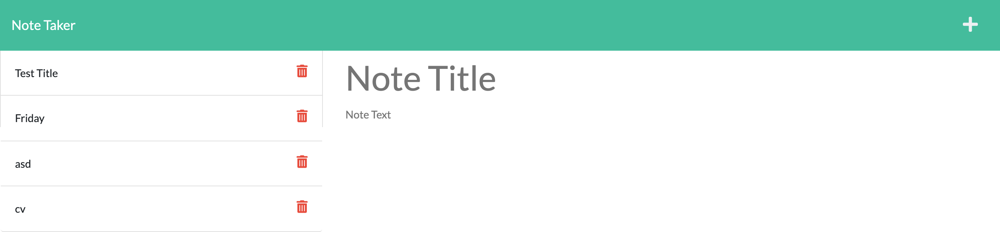

# Note Taker

## Description

Using Express.js, the application allows a user to save notes with a title. 

## Installation

Make sure to use npm i at the beginning of each session to ensure you have the necessary dependencies. It is also beneficial to include Heroku and Insomnia for additional utility. 

## Usage

The application is user-friendly with basic functionality. A user simply enters a note title and the note text itself before clicking the floppy disk icon in the top right to save the note. Using JSON, the note is saved to local storage, and will display each time the page is loaded. 

## Screenshot

## Links

[GitHub](https://github.com/cbazil114/note-taker) 
[DeployedURL](https://cbazil114.github.io/note-taker/) 
[Heroku](https://damp-mountain-90978.herokuapp.com/) 

## Contributions

Repo by cbazil114 (https://github.com/cbazil114). Special thanks to the learning assistants, tutor, and teaching assistants who helped troubleshoot issues with the application. 